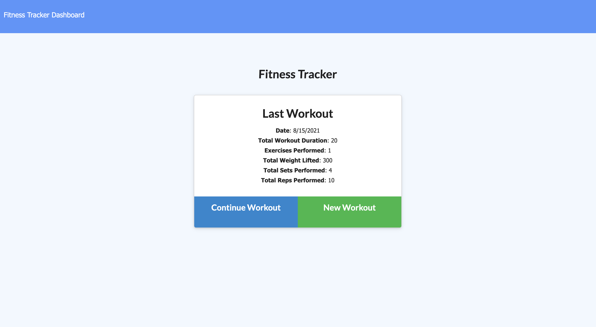
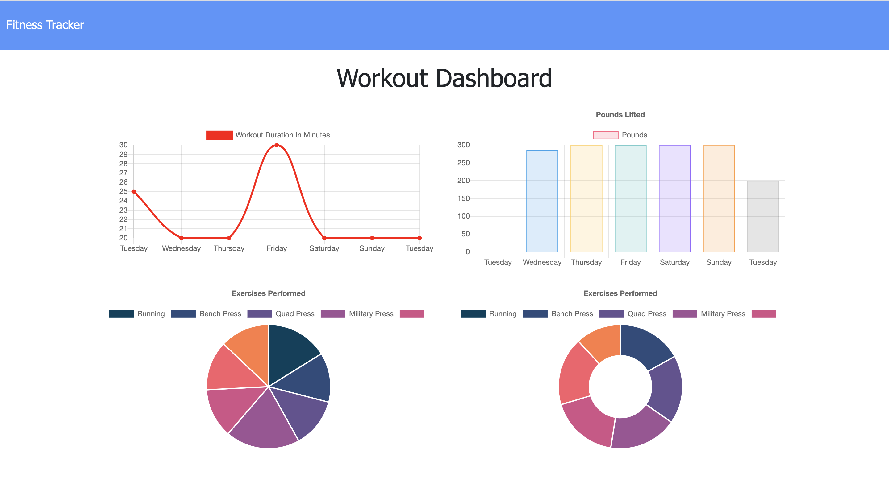

# Workout Tracker

[](https://opensource.org/licenses/ISC)

## Short Description

This Mongo Application allows users to create, edit, and store their daily workouts, as well as view their recent workout progress.

## Pre-required Software

Make sure to have downloaded and installed mongo before using this application. To learn more about how to install mongo, check out <a href="https://coding-boot-camp.github.io/full-stack/mongodb/how-to-install-mongodb">this link!</a>

## Website Features
Home Screen

Workout Dashboard


## Local Installation

To obtain this application on your local computer, first clone the repository to your desired location.

```
git clone https://github.com/pbyakod/workout-tracker.git
```
Next, on your command line, navigate to the root directory and enter the following.

```
npm i
```
This will install all the required dependencies needed to run the application. Once complete, check to see if mongo is operational.

```
mongo
```
If mongo is running smoothly, seed the database using the following.

```
npm run seed
```
Finally, run the application.

```
npm run start
```

## Walkthrough GIF


## Using The App on Your Browser - Heroku

If you'd simply like to view the deployed application on your local browser, click the link below. 

https://stormy-reaches-44188.herokuapp.com/

## Technologies Used

- HTML
- CSS
- Javascript
- MongoDB
- Node

## Author

Pranav Byakod [<a href="www.github.com/pbyakod">Github Profile</a>]